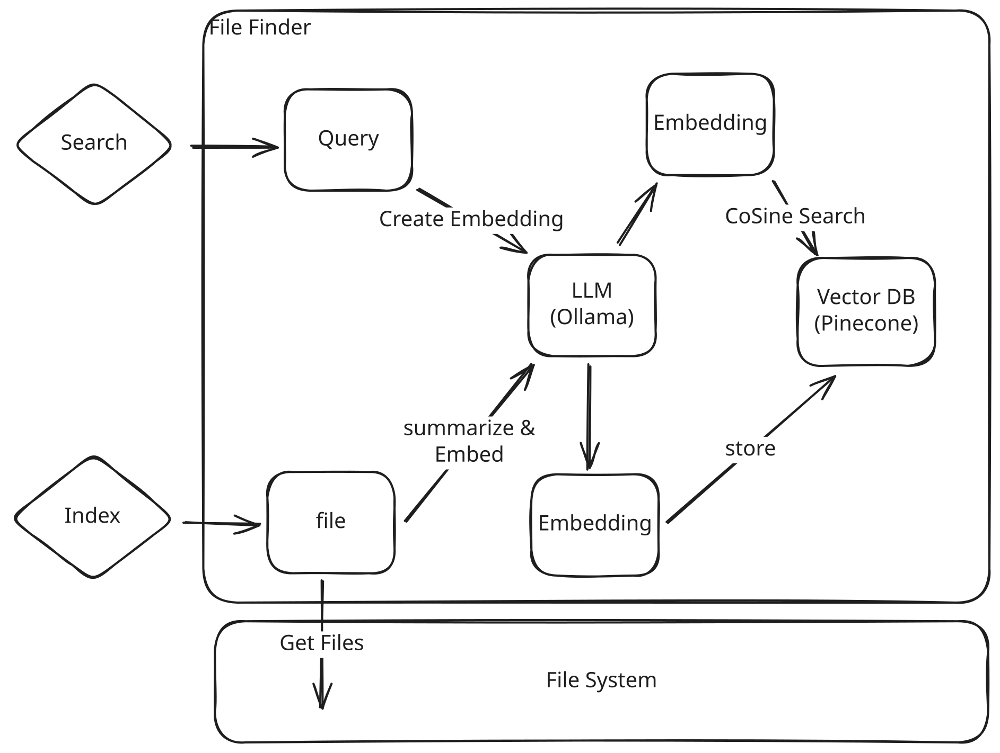

# File Finder

Search through local file to find what you're looking for.

## Usage

```shell
usage: main.py [-h] [-f FIND] [-l LOAD] [-v] [-c CONFIDENCE]

File Finder.

options:
  -h, --help            show this help message and exit
  -f, --find FIND       Description of what file to find.
  -l, --load LOAD       Path to load into file finder system.
  -v, --verbose         Verbose logs for indexing and searching
  -c, --confidence      confidence threshold when finding files
```

### Environment

Requirements:

1. LLM (ollama) With embedding capable model
2. VectorDB (Pinecone)


